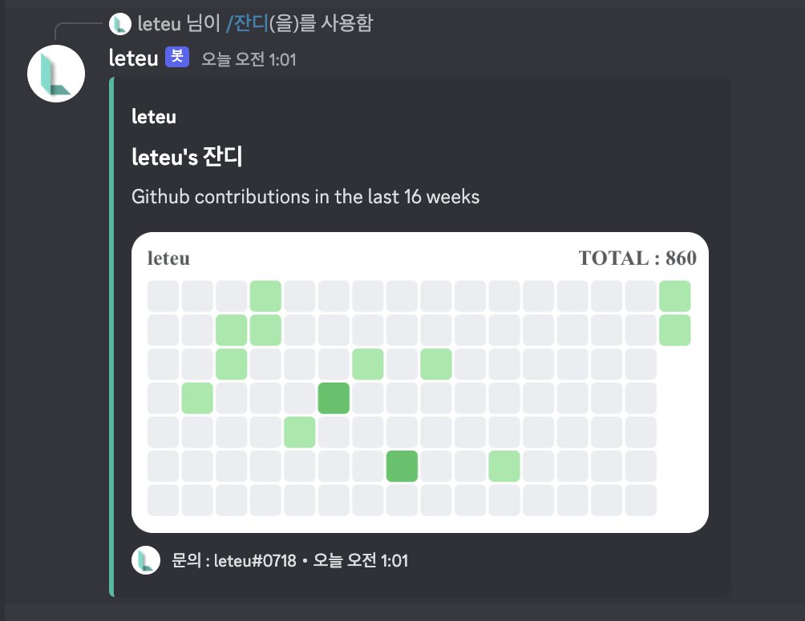

# Grass Bot

Github 잔디 공유 봇

- [Grass Bot](#grass-bot)
  - [소개](#소개)
  - [기능](#기능)
    - [/help](#help)
    - [!grass](#grass)
    - [!stats](#stats)

## ✏️ 소개

Github의 잔디 및 스탯을 공유할 수 있습니다.
Check Github contributions on discord.

## 🛠️ 기능

### help

```sh
/help
# or
/도움말
```

명령어 리스트를 보여줍니다.
showing command list.


### grass

```sh
/grass <Github user name>
# or
/잔디 <Github user name>
```



### stats

```sh
/stats <Github user name>
# or
/통계 <Github user name>
```


